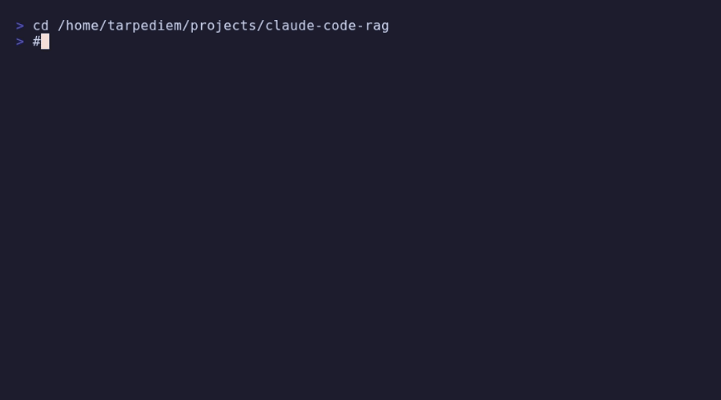

# Claude Code RAG

> **Give Claude Code a persistent memory** - Local semantic search powered by Ollama + ChromaDB

[](https://opensource.org/licenses/MIT)
[](https://www.python.org/downloads/)
[](https://modelcontextprotocol.io/)



## Why?

Claude Code forgets everything between sessions. Your `CLAUDE.md` file grows, but searching it sucks.

**claude-code-rag** gives Claude Code a semantic memory:
- Index your docs, configs, and code
- Search by meaning, not keywords
- Remember decisions, bugfixes, and architecture choices
- 100% local - no cloud, no API keys

## Features

- **Semantic search** - Find relevant context even with different wording
- **Smart chunking** - Splits markdown by headers, Python by functions, JS by exports
- **Multi-format** - `.md`, `.txt`, `.py`, `.js`, `.ts`, `.json`, `.yaml`, `.sh`, `.toml`
- **Memory types** - Tag memories as `decision`, `bugfix`, `architecture`, `snippet`...
- **Dual-scope memory** - 📁 Project-specific + 🌐 Global (system-wide) memories
- **MCP integration** - Native Claude Code tools, no bash needed
- **Fast** - ~30ms search, ~1s/file indexing on AMD iGPU

## Quick Start

```bash
# 1. Clone
git clone https://github.com/tarpediem/claude-code-rag.git
cd claude-code-rag

# 2. Install
python -m venv .venv && source .venv/bin/activate
pip install -r requirements.txt

# 3. Pull embedding model
ollama pull nomic-embed-text

# 4. Test it
python claude_rag.py index ~/CLAUDE.md
python claude_rag.py search "how to configure GPU"
```

## MCP Integration (Recommended)

Add to `~/.claude.json` under your project:

```json
{
  "mcpServers": {
    "claude-rag": {
      "command": "/path/to/venv/bin/python",
      "args": ["/path/to/mcp_server.py"]
    }
  }
}
```

Restart Claude Code. You now have 8 native tools:

| Tool | Description |
|------|-------------|
| `rag_search` | Semantic search in memory (with optional type filter) |
| `rag_index` | Index files or directories |
| `rag_store` | Manually store a memory with type/tags |
| `rag_capture` | Auto-capture from Claude Code sessions |
| `rag_list` | List memories with filtering |
| `rag_forget` | Delete memories by query or ID |
| `rag_stats` | Show memory statistics |
| `rag_health` | Check Ollama/ChromaDB status |

## Usage Examples

### Index your codebase
```bash
# Single file
python claude_rag.py index ~/CLAUDE.md

# Entire directory (all supported formats)
python claude_rag.py index ~/myproject/
```

### Search
```bash
python claude_rag.py search "database connection error"
python claude_rag.py search "how to deploy"
```

### Store a decision (MCP)
```
Claude, store this: "We chose PostgreSQL over MongoDB for ACID compliance"
→ rag_store(content="...", memory_type="decision", tags=["database"])
```

### List memories (MCP)
```
Claude, show me all my bugfix memories
→ rag_list(memory_type="bugfix")
```

### Delete memories (MCP)
```
Claude, forget everything about the old auth system
→ rag_forget(query="old auth system", confirm=true)
```

### Search with filter (MCP)
```
Claude, search my architecture decisions about caching
→ rag_search(query="caching", memory_type="architecture")
```

### Auto-capture from sessions (MCP)
```
Claude, capture memories from my recent sessions
→ rag_capture(max_sessions=5, min_confidence=0.7)

# Preview first without storing:
→ rag_capture(dry_run=true)
```

### Check health
```bash
python claude_rag.py stats
# Or via MCP: rag_health
```

## Memory Scopes

claude-code-rag supports two memory scopes:

| Scope | Icon | Description |
|-------|------|-------------|
| `project` | 📁 | Project-specific memories (default for store/index) |
| `global` | 🌐 | System-wide knowledge (your machine, preferences) |
| `all` | | Both scopes (default for search/list) |

**Examples:**
```
# Store system info globally
→ rag_store(content="AMD 890M iGPU with ROCm", scope="global")

# Index project docs locally
→ rag_index(path="./docs", scope="project")

# Search everywhere (default)
→ rag_search(query="GPU config")

# Search only global
→ rag_search(query="GPU config", scope="global")
```

## Supported File Types

| Extension | Chunking Strategy |
|-----------|-------------------|
| `.md` | Split by `##` headers |
| `.py` | Split by `def`/`class` |
| `.js`, `.ts` | Split by `function`/`const`/`export` |
| `.json`, `.yaml`, `.toml` | Generic with overlap |
| `.txt`, `.sh` | Generic with overlap |

## Configuration

| Env Variable | Default | Description |
|--------------|---------|-------------|
| `OLLAMA_URL` | `http://localhost:11434` | Ollama server |
| `EMBED_MODEL` | `nomic-embed-text` | Embedding model |
| `CHROMA_PATH` | `~/.local/share/claude-memory` | Database path |

## Performance

Tested on AMD Radeon 890M (integrated GPU) with ROCm:

| Operation | Speed |
|-----------|-------|
| Search | ~30ms |
| Index | ~1s/file |
| Embedding | ~100 tok/s |

## Roadmap

See [ROADMAP.md](ROADMAP.md) for planned features:
- [x] Auto-capture from Claude Code sessions
- [ ] Export memories to CLAUDE.md
- [ ] Web UI dashboard
- [ ] PyPI package

## Contributing

PRs welcome! Check the roadmap for ideas.

## License

MIT

---

**Built for the [Claude Code](https://claude.ai/code) community**
