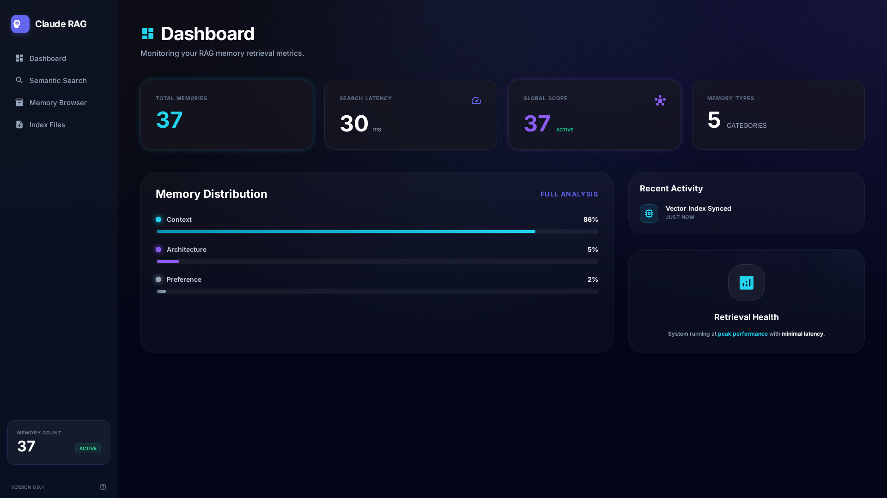
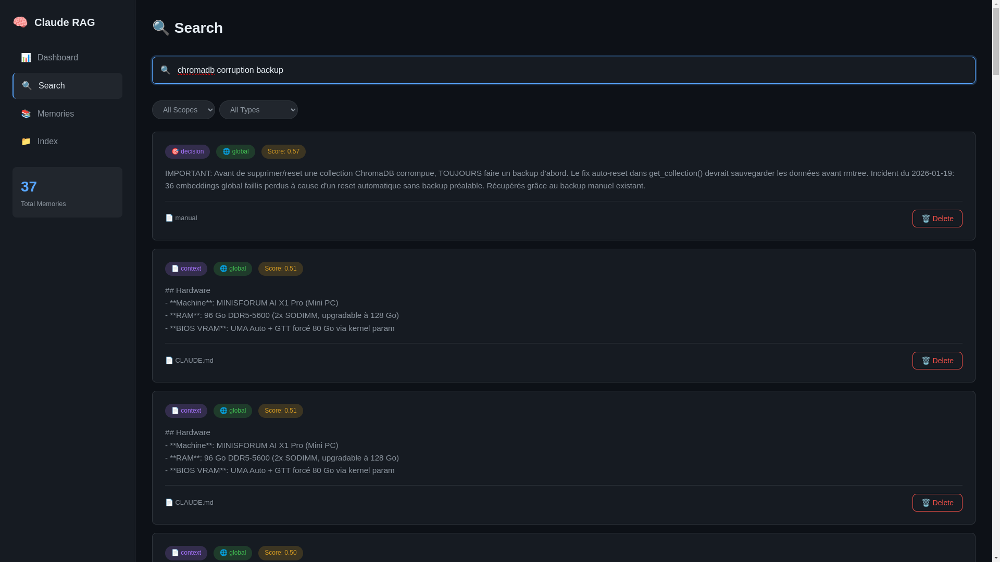
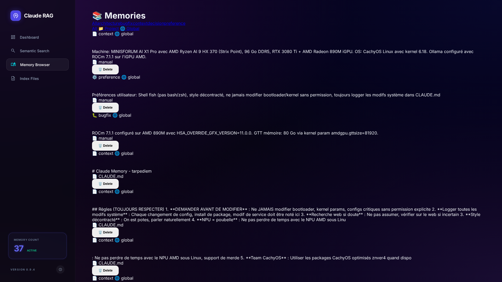
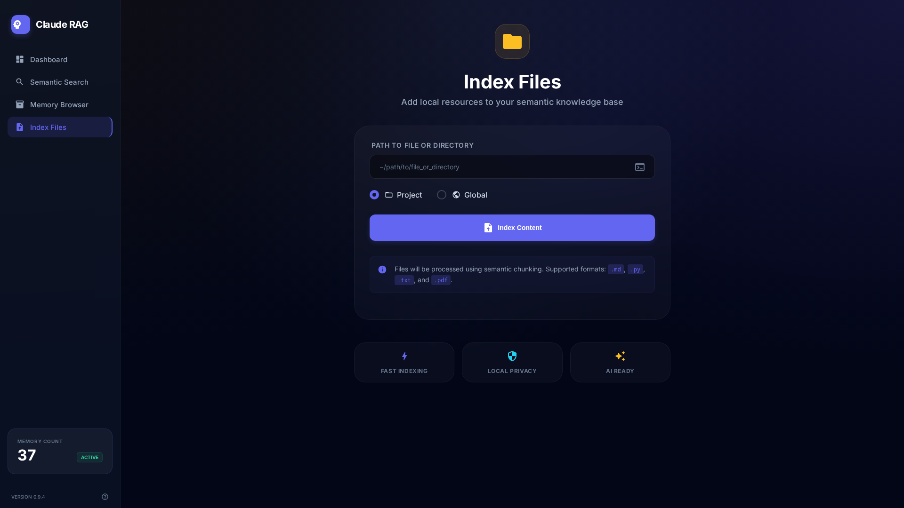

# 🧠 Claude Code RAG

> **Give Claude Code a persistent memory** – Local semantic search powered by Ollama + ChromaDB

[](https://opensource.org/licenses/MIT)
[](https://www.python.org/downloads/)
[](https://modelcontextprotocol.io/)
[](https://github.com/psf/black)


_Modern Gemini-inspired UI with Material Icons Round, glassmorphism, and neon accents_

## ✨ Features

### 🎯 Core Capabilities
- **Semantic Search** – Find relevant context by meaning, not keywords
- **Smart Chunking** – Intelligently splits markdown by headers, Python by functions, JS by exports
- **Multi-Format Support** – `.md`, `.py`, `.js`, `.ts`, `.json`, `.yaml`, `.sh`, `.toml` and more
- **Memory Types** – Tag memories as `decision`, `bugfix`, `architecture`, `snippet`, `preference`
- **Dual-Scope** – 📁 Project-specific + 🌐 Global (system-wide) memories
- **100% Local** – No cloud, no API keys, complete privacy

### 🛠️ Interfaces
- **🔌 MCP Integration** – Native Claude Code tools (13 tools available)
- **🌐 Web Dashboard** – Gemini-inspired UI with Material Icons Round, color-coded badges, and professional glassmorphism
- **💻 CLI** – Fast command-line interface for power users
- **📟 TUI** – Interactive Textual-based terminal UI with real-time search

### ⚡ Performance
Tested on AMD Radeon 890M (iGPU) with ROCm:
- **Search**: ~30ms per query
- **Indexing**: ~1s per file
- **Embeddings**: ~100 tokens/s

---

## 📦 Installation

### 🚀 Easy Install

**Linux / macOS (Recommended)**
```bash
curl -fsSL https://raw.githubusercontent.com/tarpediem/claude-code-rag/main/install.sh | bash
```

**Windows (PowerShell as Administrator)**
```powershell
iwr -useb https://raw.githubusercontent.com/tarpediem/claude-code-rag/main/install.ps1 | iex
```

**Or Ask Claude Code (All Platforms)**

Copy this prompt into Claude Code and it will install everything for you:

```
Please install Claude Code RAG for me. Adapt the installation for my operating system:

1. Clone https://github.com/tarpediem/claude-code-rag to the appropriate location:
   - Linux: ~/.local/share/claude-code-rag
   - macOS: ~/Library/Application Support/claude-code-rag
   - Windows: %LOCALAPPDATA%\claude-code-rag

2. Install dependencies using uv (preferred) or pip
3. Create a CLI launcher appropriate for my OS
4. Pull the nomic-embed-text model with ollama (if installed)
5. Initialize the database
6. Show me how to configure the MCP server in ~/.claude.json

Repository: https://github.com/tarpediem/claude-code-rag
```

See [CLAUDE_INSTALL.md](CLAUDE_INSTALL.md) for detailed instructions and [PLATFORM_NOTES.md](PLATFORM_NOTES.md) for platform-specific configuration.

### Prerequisites
- **Python 3.10+** ([Download](https://www.python.org/downloads/))
- **Ollama** ([Download](https://ollama.ai/download))
- **uv** (recommended, [Install](https://github.com/astral-sh/uv)) or pip
- **Git** (usually pre-installed on Linux/macOS, [Windows download](https://git-scm.com/download/win))

### Manual Installation

<details>
<summary>Click to expand manual installation steps</summary>

```bash
# 1. Clone the repository
git clone https://github.com/tarpediem/claude-code-rag.git
cd claude-code-rag

# 2. Install dependencies (with uv)
uv sync

# Or with pip
python -m venv .venv
source .venv/bin/activate  # On Windows: .venv\Scripts\activate
pip install -e .

# 3. Pull the embedding model
ollama pull nomic-embed-text

# 4. Initialize and test
claude-rag init
claude-rag index ~/your-docs/
claude-rag search "how to configure something"
```

</details>

---

## 🚀 Usage

### Command Line Interface

#### Index files or directories
```bash
# Single file
claude-rag index ~/CLAUDE.md

# Entire directory (recursively indexes all supported formats)
claude-rag index ~/myproject/docs/

# Index to global scope (system-wide knowledge)
claude-rag index ~/machine-specs.md --scope global
```

#### Search memories
```bash
# Basic search (searches both project and global)
claude-rag search "database optimization"

# Filter by memory type
claude-rag search "bug fixes" --type bugfix

# Search only global memories
claude-rag search "GPU config" --scope global
```

#### View statistics
```bash
claude-rag stats
```

Output:
```
📊 RAG Statistics

📁 Project: 42 chunks
🌐 Global: 18 chunks
Total: 60 chunks

Types:
  - context: 35
  - decision: 12
  - bugfix: 8
  - architecture: 5
```

### Web Dashboard

Launch the modern web interface:

```bash
claude-rag web
# Opens at http://localhost:8420
```

**Design Features:**
- 🎨 **Gemini-Inspired** – Modern, compact layout inspired by professional AI dashboards
- ✨ **Glassmorphism** – Subtle frosted glass effects with backdrop blur
- 🎯 **Material Icons Round** – Google's rounded icon set for consistency
- 🏷️ **Color-Coded Badges** – Visual memory type identification (cyan, violet, amber, etc.)
- 📱 **Responsive Grid** – Adaptive layouts for all screen sizes
- 🌊 **Smooth Interactions** – Hover effects, transitions, and reveal animations

**Functional Features:**
- 📊 **Dashboard** – Clean stats cards with memory distribution charts and system health
- 🔍 **Semantic Search** – Large search bar with pill-style filters and grid results
- 📚 **Browse Memories** – Dual-row pill filters, color-coded badges, hover-to-delete
- 📂 **Index Files** – Centered form with custom radio buttons and feature cards

<table>
  <tr>
    <td width="50%"></td>
    <td width="50%"></td>
  </tr>
  <tr>
    <td align="center"><em>📊 Dashboard with memory analytics</em></td>
    <td align="center"><em>🔍 Semantic search with pill filters</em></td>
  </tr>
  <tr>
    <td width="50%"></td>
    <td width="50%"></td>
  </tr>
  <tr>
    <td align="center"><em>📚 Memory browser with color-coded badges</em></td>
    <td align="center"><em>📂 File indexing with feature cards</em></td>
  </tr>
</table>

### Interactive TUI

```bash
claude-rag ui
```

Navigate with keyboard:
- `Tab` – Switch between search/results
- `↑/↓` – Navigate results
- `/` – Focus search
- `q` – Quit

---

## 🔌 MCP Integration (Recommended)

Add to your `~/.claude.json` (or project-specific `.claude.json`):

```json
{
  "mcpServers": {
    "claude-rag": {
      "command": "uv",
      "args": [
        "--directory",
        "/absolute/path/to/claude-code-rag",
        "run",
        "python",
        "mcp_server.py"
      ]
    }
  }
}
```

Restart Claude Code. You'll now have **13 native tools**:

| Tool | Description |
|------|-------------|
| `rag_search` | Semantic search with optional type/scope filters |
| `rag_index` | Index files or directories into memory |
| `rag_store` | Manually store a memory with tags |
| `rag_sync` | Sync watched files (auto-detects changes) |
| `rag_list` | List memories with filtering |
| `rag_forget` | Delete memories by query or ID |
| `rag_stats` | Show memory statistics |
| `rag_health` | Check Ollama/ChromaDB status |
| `rag_capture` | Auto-capture from Claude Code sessions |
| `rag_export` | Export to AGENTS.md/CLAUDE.md/GEMINI.md |
| `rag_backup` | Export all memories to JSON |
| `rag_restore` | Restore memories from JSON backup |
| `rag_reset` | Clear entire database (with confirmation) |

### 🚀 Auto-RAG Skill (Recommended)

The project includes a **Claude Skill** that automatically teaches Claude to use the RAG system correctly, without any manual intervention needed.

**Location**: `.claude/skills/auto-rag/SKILL.md`

**What it does automatically:**
- ✅ Search RAG at session start for context
- ✅ Store decisions, bug fixes, and snippets **during** work (not after)
- ✅ Use proper memory types and tags
- ✅ Sync after important file changes

**Setup**: Just copy the skill to your project or global skills folder:
```bash
# For this project (already included)
cp -r .claude/skills/auto-rag ~/.claude/skills/

# Now works across all your projects!
```

The skill activates automatically during coding/debugging—no commands needed. Even beginners get professional RAG workflow without knowing how it works.

### Example MCP Usage

```
User: How did we configure the GPU last time?
Claude: Let me search the RAG...
→ rag_search(query="GPU configuration", scope="global")

User: Store this decision for later
Claude: I'll save that to your memory.
→ rag_store(
    content="Chose PostgreSQL over MongoDB for ACID compliance",
    memory_type="decision",
    tags=["database", "architecture"]
  )
```

---

## 📚 Memory Types & Scopes

### Memory Types

| Type | Use Case | Example |
|------|----------|---------|
| `context` | General information, docs | README content, API docs |
| `decision` | Technical decisions, rationale | "Chose React over Vue because..." |
| `bugfix` | Bug fixes and solutions | "Fixed memory leak by..." |
| `architecture` | System design, patterns | "Microservices architecture for..." |
| `preference` | User/team preferences | "Always use async/await over callbacks" |
| `snippet` | Code snippets, examples | Reusable functions, configs |

### Scopes

| Scope | Icon | Description | Storage |
|-------|------|-------------|---------|
| `project` | 📁 | Project-specific knowledge | `~/.local/share/claude-memory/<project-id>` |
| `global` | 🌐 | System-wide knowledge | `~/.local/share/claude-memory/global` |
| `all` | – | Search both (default) | Both locations |

**Examples:**

```bash
# Store system information globally
→ rag_store(
    content="Machine: AMD Ryzen 9 with 96GB RAM, ROCm 7.1",
    scope="global",
    memory_type="context"
  )

# Index project docs locally
claude-rag index ./docs --scope project

# Search everywhere (default)
claude-rag search "deployment process"
```

---

## ⚙️ Configuration

### Environment Variables

| Variable | Default | Description |
|----------|---------|-------------|
| `OLLAMA_URL` | `http://localhost:11434` | Ollama server URL |
| `EMBED_MODEL` | `nomic-embed-text` | Embedding model name |
| `CHROMA_PATH` | `~/.local/share/claude-memory` | Database storage path |

### Custom Configuration

```bash
# Use remote Ollama instance
export OLLAMA_URL=http://192.168.1.100:11434
claude-rag search "query"

# Use different embedding model
export EMBED_MODEL=all-minilm
ollama pull all-minilm
claude-rag search "query"

# Custom storage location
export CHROMA_PATH=~/my-custom-path
claude-rag init
```

---

## 🏗️ Architecture

```
claude-code-rag/
├── claude_rag.py          # CLI entry point
├── mcp_server.py          # MCP server for Claude Code
├── web_ui.py              # Web dashboard (FastAPI + HTMX)
├── rag_tui.py             # Terminal UI (Textual)
├── session_parser.py      # Parse Claude Code sessions
├── pyproject.toml         # Project config
└── assets/                # Screenshots for README
```

### How It Works

1. **Indexing**: Files are chunked intelligently based on format
   - Markdown: Split by `##` headers
   - Python: Split by `def`/`class`
   - JavaScript/TypeScript: Split by `function`/`const`/`export`
   - Generic: Fixed-size chunks with overlap

2. **Embedding**: Text chunks are embedded using Ollama
   - Model: `nomic-embed-text` (137M params, fast & accurate)
   - Dimension: 768
   - Cached for performance

3. **Storage**: Embeddings stored in ChromaDB
   - Separate collections for project/global scope
   - Metadata: type, tags, source, timestamp
   - Persistent on disk

4. **Search**: Semantic search via cosine similarity
   - Query → Embedding → Vector search
   - Optional filters: type, scope, source
   - Returns top N results with scores

---

## 🛡️ Security

Version 0.9.3+ includes comprehensive security hardening:

### Input Validation
- Query length limits (10k chars)
- Result count limits (100 max)
- Content size limits (100MB)
- Scope/type validation
- Memory ID format validation

### Path Security
- Path traversal protection (`../` blocked)
- Symlink attack prevention
- Base path validation
- Safe path resolution

### Data Protection
- Local-only (no external API calls)
- No telemetry or tracking
- Automatic corruption backups
- SHA256 hashing (not MD5)

### Network Security
- Default bind: `127.0.0.1` (localhost only)
- Warning for non-localhost Ollama on HTTP
- No exposed ports by default

---

## 📝 Recent Updates

### v0.9.5 (2026-01-19) - Gemini-Inspired Professional Redesign
- **Complete UI overhaul** inspired by modern Gemini designs
- **Compact, dense layout** maximizing screen real estate
- **Material Icons Round** throughout for professional appearance
- **Color-coded badge system** (Context=cyan, Architecture=violet, Bugfix=amber, etc.)
- **Refined glassmorphism** with subtle backdrop blur and dark gradients
- **Professional typography** with Inter font and proper hierarchy
- **Pill-style filters** replacing traditional dropdowns
- **Grid-based responsive layouts** for all pages
- **Hover effects** with smooth transitions and reveal animations

### v0.9.3 (2026-01-18) - Security Hardening
- Comprehensive input validation and sanitization
- Path traversal protection and symlink attack prevention
- Automatic corruption backups before database resets
- SHA256 hashing instead of MD5
- Localhost-only binding by default

---

## 🗺️ Roadmap

- [x] CLI interface
- [x] MCP server integration
- [x] TUI with Textual
- [x] Web dashboard
- [x] Auto-capture from sessions
- [x] Export to multi-agent formats (AGENTS.md, CLAUDE.md, etc.)
- [x] Comprehensive security hardening
- [x] Automatic corruption recovery with backups
- [x] Modern dark neon UI with glassmorphism
- [ ] PyPI package
- [ ] Docker image
- [ ] Vim/Neovim plugin
- [ ] VS Code extension
- [ ] Obsidian plugin

---

## 🤝 Contributing

Contributions welcome! Please:

1. Fork the repository
2. Create a feature branch (`git checkout -b feature/amazing-feature`)
3. Commit your changes (`git commit -m 'Add amazing feature'`)
4. Push to the branch (`git push origin feature/amazing-feature`)
5. Open a Pull Request

### Development Setup

```bash
# Clone and install in development mode
git clone https://github.com/tarpediem/claude-code-rag.git
cd claude-code-rag
uv sync --dev

# Run tests (when available)
pytest

# Format code
black .
```

---

## 📄 License

MIT License - see [LICENSE](LICENSE) file for details.

---

## 🙏 Acknowledgments

- **Ollama** – Local LLM inference
- **ChromaDB** – Vector database
- **Claude Code** – AI pair programming tool
- **FastAPI + HTMX** – Modern web framework

---

## 📞 Support

- 🐛 **Bug Reports**: [GitHub Issues](https://github.com/tarpediem/claude-code-rag/issues)
- 💡 **Feature Requests**: [GitHub Discussions](https://github.com/tarpediem/claude-code-rag/discussions)
- 📖 **Documentation**: [GitHub Wiki](https://github.com/tarpediem/claude-code-rag/wiki)

---

**Built with ❤️ for the [Claude Code](https://claude.ai/code) community**
